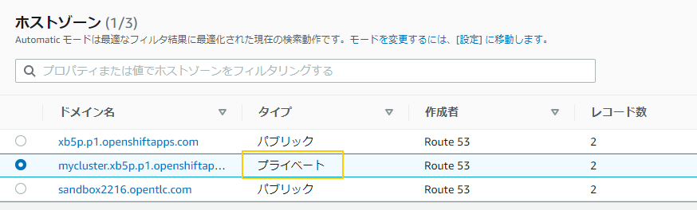
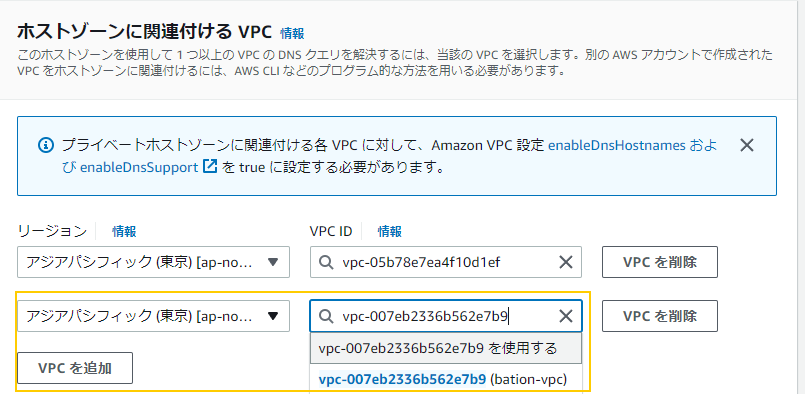

# 作業環境のセットアップ

以下の環境をセットアップされている環境を前提としています。

- AWS CLI 
- rosa コマンド
- jq コマンド (optional)


AWS CLI のインストールは、[こちらの AWSのページを参照して下さい](https://docs.aws.amazon.com/ja_jp/cli/latest/userguide/getting-started-install.html)
インストール後、作業対象の AWS アカウントの情報を入力します。

```
$ aws configure
AWS Access Key ID [****************PUMH]: ABCDEIFGHIJKPUMH           # 管理者から教えてもらってください
AWS Secret Access Key [****************Ztkt]: abcdefghijkZtkt　　　　 # 管理者から教えてもらってください
Default region name [ap-northeast-1]: ap-northeast-1 
Default output format [None]: 
$ 
```

ROSA コマンドは、[こちらか](https://console.redhat.com/openshift/downloads)、もしくは[こちから](https://mirror.openshift.com/pub/openshift-v4/clients/rosa/latest/)ダウンロード可能です。
Linux の場合は以下でインストール可能です。

```
curl -LO https://mirror.openshift.com/pub/openshift-v4/clients/rosa/latest/rosa-linux.tar.gz
tar -zxf rosa-linux.tar.gz 
sudo mv ./rosa /usr/local/bin/
```


jq コマンドは Ubuntu の場合は、
```
 sudo apt-get install jq
 ```

RHEL系 (Amazon Linux等) の場合は、
```
 sudo yum install jq
```
でインストール可能です。

# この Repository のクローン

自分の端末上で以下のコマンドを実行して、このレポジトリーをローカルにダウンロードします。

```
git clone https://g]ithub.com/yuhkih/rosa-nw-template.git
cd rosa-nw-template
```

作業に必要な CloudFormation の Template や、sh 等は `rosa-nw-template` ディレクトリに含まれています。

# ROSA/RHOAM 用のNetwork のデプロイ

1. 以下の CloudFormation のテンプレートを使用して、ROSA をインストールするためのネットワークを作成します。

    ROSA の Private Cluser (with PrivatreLink) 構成では、ユーザーが自分で必要なネットワークを AWS 内にデプロイした後、ROSA をインストールする必要があります。

    Single AZ 環境の場合は、
    ```
     rosa-PRV_NAT_FW-sz.yaml
    ```
    
    Multi AZ 環境の場合は

    ```
    rosa-PRV_NAT_FW-mz.yaml
    ```
    を使用して、デプロイ完了まで待ちます。

    これをデプロイする事で、Single AZ の場合は、以下のような環境が作成されます。

     


# PrivateLink を使用した RHOAM 用 ROSA Cluster のインストール (実験バージョン)

このスクリプトは実験的なものなので通常は読み飛ばしてください。通常の構築になれた後、使用してみて下さい。

PrivateLink の ROSA 環境を、前述の CloudFormation テンプレートで Deploy 済みの Network 環境に構築するスクリプトです。AWS の subnet ID の取得などの面倒な作業を自動化しています。
前述の CloudFormation で作成したタグを使用しているため、手動でデプロイした Netowork 環境では使用できません。

cluster名などは、shell 内で決め打ちで書き込んであるので、cluster名などを変更したい場合は shell を編集する事で可能です。

Single AZ 環境の場合

```
./memos/create-rosa-privatelink-cluster-sz.sh
```


Multi AZ 環境の場合

```
./memos/create-rosa-privatelink-cluster-mz.sh
```

# PrivateLink を使用した RHOAM 用 ROSA Cluster のインストール

1. CloudFormation の画面で、作成したスタックを選択し「出力」のタブに行くと以下のように Private Subnet の ID が表示されているはずです。PrivateLink を使ったインストールには、インストール時にこの IDの値を聞かれるのでメモしておきます。(Single AZ の Network を CloudFormation でデプロイした場合は、PrivateSubnetID1 のみ存在します。)

    ```
    PrivateSubnetID1 subnet-098e7998da1721a95 Private Subnet ID1
    PrivateSubnetID2 subnet-047a7fa3fb3e1307e Private Subnet ID2
    PrivateSubnetID3 subnet-0c73a76a9757a2174 Private Subnet ID3
    ```
    
    もしくは、jq コマンドをインストールしている場合は、AWS CLI で以下のように取得できます。
    
    Multi AZ 環境の場合 ( Private Subnet は 3つあります)

    ```
    # PrivateSubnetID1
    aws ec2 describe-subnets | jq -r '.Subnets[] | [ .CidrBlock, .SubnetId, .AvailabilityZone, .Tags[].Value ] | @csv' | grep Private-Subnet1 | awk -F'[,]' '{print $2}' | sed 's/"//g'
    # PrivateSubnetID2
    aws ec2 describe-subnets | jq -r '.Subnets[] | [ .CidrBlock, .SubnetId, .AvailabilityZone, .Tags[].Value ] | @csv' | grep Private-Subnet2 | awk -F'[,]' '{print $2}' | sed 's/"//g'
    # PrivateSubnetID3
    aws ec2 describe-subnets | jq -r '.Subnets[] | [ .CidrBlock, .SubnetId, .AvailabilityZone, .Tags[].Value ] | @csv' | grep Private-Subnet3 | awk -F'[,]' '{print $2}' | sed 's/"//g'
    ```

    Single AZ 環境の場合  ( Private Subnet は 1つです)


    ```
    # export PrivateSubnetID1
    aws ec2 describe-subnets | jq -r '.Subnets[] | [ .CidrBlock, .SubnetId, .AvailabilityZone, .Tags[].Value ] | @csv' | grep Private-Subnet1 | awk -F'[,]' '{print $2}' | sed 's/"//g'
    ```

1. ROSA の作成に必要な Role と Policy を作成します。
    ```
    rosa create account-roles -m auto -y
    ```

1. ROSA のクラスターをデプロイします。

    `rosa create  cluster --sts` で開始し、インタラクティブ型式でパラメーターを埋めていきます。

    ```bash
    rosa create cluster --sts
    I: Enabling interactive mode
    ? Cluster name:　<クラスター名>
    ...
    ...
    ? External ID (optional): 
    ? Operator roles prefix: mycluster-r6h2
    ? Multiple availability zones (optional): Yes
    ? AWS region: ap-northeast-1
    ? PrivateLink cluster (optional): Yes
    ? Subnet IDs (optional):  [Use arrows to move, space to select, <right> to    all, <left> to none, type to filter, ? for more help]
    [ ]  subnet-0872f119b038bf6fa (ap-northeast-1c)
    [ ]  subnet-0591073b34256e366 (ap-northeast-1d)
    [x]  subnet-098e7998da1721a95 (ap-northeast-1d)
    [ ]  subnet-0ad6cc99b8f3eb93c (ap-northeast-1d)
    [ ]  subnet-008441a144bcdb32f (ap-northeast-1a)
    [x]  subnet-047a7fa3fb3e1307e (ap-northeast-1a)
    [x]  subnet-0c73a76a9757a2174 (ap-northeast-1c)
    ...
    ...
    ```
    - Multiple availability zones (optional)は Yes です。
    - AWS region は、 ap-northeast-1 です。
    - PrivateLink cluster (optional)は Yes にしてください。
    - PrivateLink を使った Private Cluster の場合は、途中で 3つのサブネットＩＤを指定するように指示されるので、前述のメモしてあった Private サブネットの IDを入力します。
    - RHOAM の要件として、Node 数は最低4本以上の Worker Node 必要です。Multi AZ 構成では 3の倍数である必要があるので 6本を指定します。

1. 必要な AWS の IAM Role と、OIDC Provider を作成します。
    ```
    ClusterName=<クラスター名>  # rosa create cluster　で指定した値
    rosa create operator-roles -y -m auto --cluster $ClusterName
    rosa create oidc-provider -y -m auto --cluster $ClusterName
    ```
    
    > この作業をしないと `rosa create cluster` が途中で止まったままになり、cluster 作成が進みません。


    
1. インストールが終わるまで待ちます。
    ```
    rosa logs install -c $ClusterName --watch
    ```
1. インストールが完了したら管理者ユーザーを作成します。
    ```
    rosa create admin -c $ClusterName

    I: Admin account has been added to cluster 'mycluster'.
    I: Please securely store this generated password. If you lose this password you can delete and recreate the cluster admin user.
    I: To login, run the following command:

   oc login https://api.mycluster.xb5p.p1.openshiftapps.com:6443 --username cluster-admin --password eKrGh-SfrLd-Evak9-abcde

    I: It may take up to a minute for the account to become active.
    ```
   
    この時出てきた管理者用のログインコマンドの以下の部分は、忘れずに txt ファイル等にメモしておきます。

    ```
    oc login https://api.mycluster.xb5p.p1.openshiftapps.com:6443 --username cluster-admin --password eKrGh-SfrLd-Evak9-abcde
    ```

    ログインできるようになるまで、5分程度かかる事があります。
    
    `Login failed (401 Unauthorized)` が出てきても正常です。暫く待てばログインできるようになるはずです。

1. Identity Provider の連携として、ここでは GitHub の User 認証でログインできるようにしておきます。

    ```
    rosa create idp --type=github -c $ClusterName
    ```

    - GitHub ユーザーの少なくても一つは dedicated-admin グループに割り当て、管理者として使用します。
    - ここでは GitHub 連携の詳細の手順は省略します。GitHub 連携の詳細については[こちらを](https://qiita.com/Yuhkih/items/367eccc0cfe64dfbd915#github-id-%E9%80%A3%E6%90%BA) 参照して下さい。


# GitHub ユーザーの dedicated-admin グループへの追加

https://console.redhat.com にアクセスしてインストールしたクラスターを選択します。

Access control => Cluster Roles and Access で、github ユーザーを dedicated-admins グループに追加しておきます。
RHOAM の操作には、userid / password ではなく外部 Identity Provider 連携の User が必要になります。

 

この手順は後でも良いですが、RHOAM をインストール後に、この操作を行うと、直後はアクセス権が上手く反映されないように見えます。
RHOAM のインストール後に、この権限の追加を行い、RHOAM のコンソールで "Access Denied" がでる場合は 5分程度待ってみてください。

# RHOAM add-on の インストール

RHOAM は add-on として提供されます。
STS を使用して構成した ROSA クラスター上に RHOAM add-on のインストールは、現状 CLI 環境でしか対応していませんのでご注意下さい。

1. SRE が RHOAM を管理できるように SRE用の AWS Policy を作成します。
    ```
    cat <<EOM >"rhoam-sre-support-policy.json"
    {
        "Version": "2012-10-17",
        "Statement": [
            {
                "Effect": "Allow",
                "Action": [
                    "rds:DescribeDBInstances",
                    "rds:DescribeDBClusters",
                    "rds:DescribeGlobalClusters",
                    "rds:ModifyDBInstance",
                    "rds:DeleteDBInstance",
                    "rds:DescribeDBSnapshots",
                    "rds:RestoreDBInstanceFromDBSnapshot",
                    "elasticache:DescribeReplicationGroups",
                    "elasticache:ModifyReplicationGroup",
                    "elasticache:DescribeSnapshots",
                    "elasticache:CreateReplicationGroup",
                    "elasticache:DescribeCacheClusters",
                    "elasticache:DeleteReplicationGroup",
                    "sts:GetCallerIdentity",
                    "tag:TagResources"
                ],
                "Resource": "*"
            }
        ]
    }
    EOM
    ```
1. 作成した Policy を SRE用の Role にアタッチします。
    ```
    aws iam put-role-policy --role-name ManagedOpenShift-Support-Role --policy-name rhoam-sre-support-policy --policy-document "file://rhoam-sre-support-policy.json"
    ```
1. rosa CLI を使って RHOAM をインストールします。(現状 STS 構成では GUIでの導入ができません)
    ```
    EMAIL=test@example.com  # 連絡先メールアドレス
    rosa install addon --cluster mycluster managed-api-service -y --rosa-cli-required true --cidr-range 10.1.0.0/26 --notification-email $EMAIL --addon-managed-api-service 1   --addon-resource-required true  --billing-model standard
    ```
    - 現状、このコマンドは初回と2回目は失敗するようです。1分程度時間を置いて数回繰り返してみて下さい。


# 踏み台用 VPC / Transit Gateway と踏み台のデプロイ


1. 以下の CloudFormation のテンプレートを使用してスタックを作成します。

    Single AZ の　ROSA をデプロイした場合

   ```
    bastion-vpc-and-transit-gw-sz.yaml
    ```

    Multi AZ の ROSA をデプロイした場合

    ```
    bastion-vpc-and-transit-gw-mz.yaml
    ```

    この CloudFormation Template によって、 Bastion 用の VPCとTransit Gateway が構成されます。

    Single AZ 構成の場合は以下の図の左側の VPC と踏み台となる 2つの EC2、ROSA VPC と接続するための Transit Gatway が環境が構築されます。

     

1. ROSA の VPC の Route 53 の 設定を編集します。

    このままでは、踏み台用に作成した VPC から ROSA で使用されているプライベートなドメインを解決できないため、ROSA の プライベートドメインの Zone の設定を編集して、新しく作成した踏み台用の VPCを信頼するように設定します。

    Route53の画面で`プライベート`の Zone を探します。
    

    `プライベート`Zone の設定の`ホストゾーンに関連付けるVPC`で、bastion VPＣを指定します。
    
    これで、Bastion 側から ROSAのドメインの名前解決ができるようになります。
    設定後、名前解決ができるようになるまで、1分以上かかるかもしれません。

    (サポート内に収める方法としては、必要なドメイン名とホスト名を bastion の /etc/hosts に登録しておく方法もあります。その場合は、IPアドレスが変わる可能性があるので定期的にメンテする必要が出てくるかもしれません)
# SSH Port foward の設定と Bastion へのログイン

## CLI ログイン環境のセットアップ
Private Subnet に接続された Bastion にログインするには、SSH Port Forward を設定する必要がありますが、ここでは手順をシェル化しています。

SSHの鍵は CloudFormation で Bastionがデプロイされた時に AWS 上に保管されたものを、シェル内でダウンロードして使用しています。

1. Linux の端末を2つ用意します。

1. Linux 端末1で以下のコマンドを実行します。

    Publicネットワークにある踏み台 EC2 サーバーにログインします。
    
    ```
    port-forward.sh 1
    ```

     

    ログアウトせずに、接続を保ったままにします。

1. Linux 端末2で以下のコマンドを実行します。

    Privateネットワークにある踏み台 EC2 サーバーにログインします。
    ```
    port-forward.sh 2
    ```

     

    この端末から oc コマンドなどが実行できるはずです。`oc version` が実行できるか確認してみて下さい。
    - 踏み台サーバー作成時に oc コマンド等が自動でインストールされているはずですが、まれに失敗している場合があるので、その場合は手動でインストールして下さい。

    ROSA インストール時に出力された以下の useird / password でログインできるはずです。( URL / usser id / password は、もちろん install された ROSA 毎に違います。)

    ```
    oc login https://api.mycluster.xb5p.p1.openshiftapps.com:6443 --username cluster-admin --password eKrGh-SfrLd-Evak9-abcde
    ```

    ブラウザーのアクセス URL は以下のコマンドで取得できます。

    ```
     oc whoami --show-console=true
     ```

## ブラウザアクセスのセットアップ

幾つかの場面では、GUI が使えた方が便利なケースがあります。
上記の SSH Port Forward の設定をした後、以下の作業を行います。

1. 踏み台サーバーから、openshift console の名前を に解決します。

    ```
    dig +short console-openshift-console.apps.mycluster.xb5p.p1.openshiftapps.com 
    10.0.1.44
    10.0.1.173
    ```
    
    このIPアドレスを覚えておきます。

1. hosts ファイルを編集します。

    `/etc/hosts` ファイル (Windows の場合は、`C:\Windows\System32\drivers\etc\hosts`) に以下のエントリーを作成します。IPが複数ある場合は、どちらか一つを追加すれば大丈夫です。

 
    ```
    10.0.1.44    .apps.mycluster.xb5p.p1.openshiftapps.com   
    ```

    > - apps 以降のドメイン名はユーザー環境によって違います。

1. ブラウザーに Socks サーバーを設定します。
    
    Firefox の例ですが、「Network Settings」で以下のように設定します。

    - localhost の 10044 ポート を Proxy 先として指定します。
    - Proxy DNS when using SOCKS v5 にチェックを入れます。

    